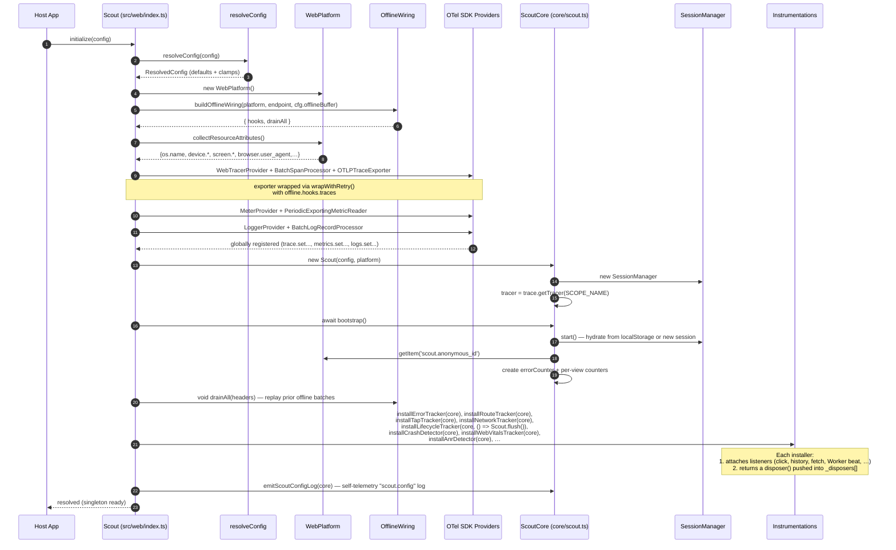
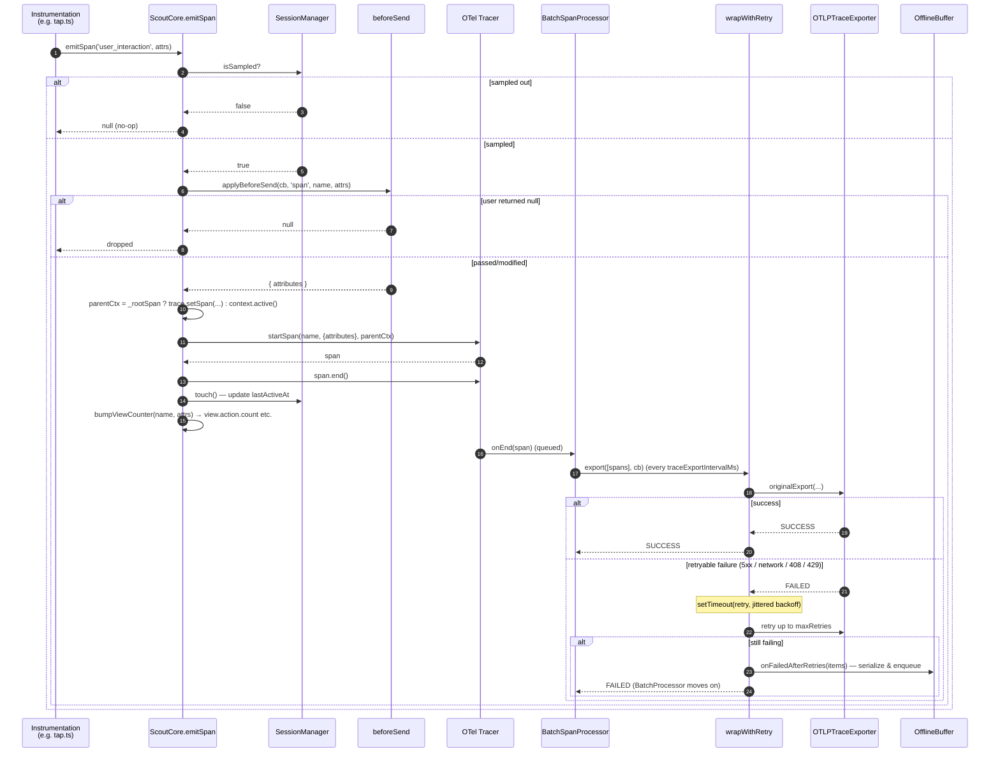
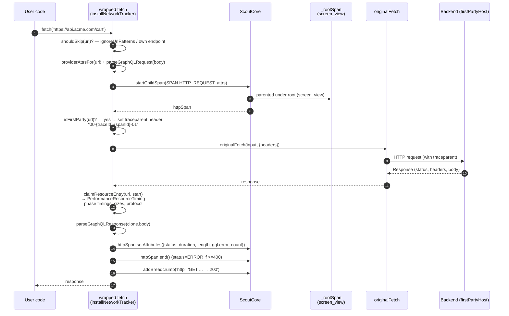
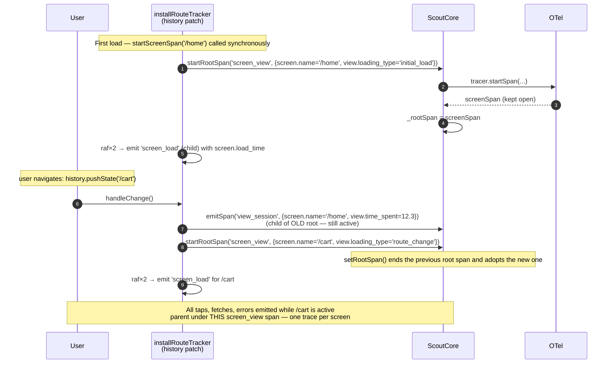
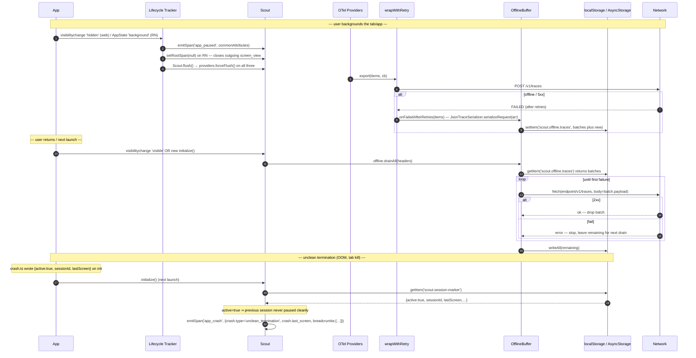

# Architecture

This document explains how data flows through `@base-14/scout-react` — from the moment the host app calls `Scout.initialize()` to the moment a span lands at the OTLP collector. It is meant for contributors who need to understand *why* the SDK is shaped the way it is before changing it.

For *what* the SDK captures and *how to configure it*, see [`README.md`](./README.md) and [`docs/configuration.md`](./docs/configuration.md).

---

## At a glance

```
                                   host app
                                      │
                                      ▼
                       Scout.initialize({ serviceName, endpoint })
                                      │
                ┌─────────────────────┼─────────────────────┐
                ▼                     ▼                     ▼
        WebTracerProvider     MeterProvider          LoggerProvider
                │                     │                     │
        BatchSpanProcessor    PeriodicExportingReader  BatchLogRecordProcessor
                │                     │                     │
         wrapWithRetry()       wrapWithRetry()        wrapWithRetry()
                │                     │                     │
         OTLPTraceExporter     OTLPMetricExporter     OTLPLogExporter
                │                     │                     │
                └──── POST /v1/traces, /v1/metrics, /v1/logs (OTLP/HTTP) ───→ collector

                          ▲ on failure: persist batch on disk
                          │             (offline-buffer)
                          │
                          └─── drainAll() on init / online / foreground
```

The architecture is essentially **one shared engine + two platform shells**:

- `src/core/` — the platform-agnostic `Scout` class plus session, breadcrumb, retry, and offline-buffer logic. No DOM or React Native imports.
- `src/web/` — browser shell. Builds `WebTracerProvider`, installs DOM-based instrumentations (click, history, fetch, web-vitals, …).
- `src/native/` — React Native shell. Builds `BasicTracerProvider`, installs RN-based instrumentations (`React.createElement` patch for taps, `AppState` lifecycle, `@react-navigation/native` ref, …).

All telemetry carries a single OpenTelemetry InstrumentationScope: `base14.scout.react`. This is a CI-enforced invariant — `src/core/scope.contract.test.ts` walks the source tree and fails the build if any code uses a different scope name.

---

## 1. Initialization

What happens between `Scout.initialize(config)` and the SDK being ready to emit.



**Key invariants:**

- `initialize()` is idempotent — `if (_instance) return;` guards re-entry.
- Providers are stashed on the facade so `flush()` and `shutdown()` can call `forceFlush()` / `shutdown()` on each.
- **React Native quirk:** the *first thing* `initialize()` does is install a global `ErrorUtils` handler that **buffers errors fired during async init** and replays them once `_instance` is set. This avoids losing the very first crash if it fires before `await core.bootstrap()` resolves.
- **React Native quirk:** `attachNavigationContainer(navRef)` called before init completes is buffered in `_pendingNavigationRefs` and wired up at the end of `initialize()` — necessary because `NavigationContainer.onReady` typically fires synchronously during the first render, before the async init resolves.

---

## 2. Span emission — the hot path

Every instrumentation funnels into `scout.emitSpan()`. Here's what it does on each call.



**Three design choices to remember:**

1. **`_rootSpan` is the "screen" span.** Every emitted span uses `parentCtx = _rootSpan ? trace.setSpan(context.active(), _rootSpan) : context.active()`. A tap on `/cart`, the http request fired from that tap, and the error that follows all share the **same trace id** as the `screen_view` span. When the route changes, `setRootSpan()` ends the previous root and adopts a new one. The result is **one trace per screen**, not one trace per event.

2. **Per-view counter mirror.** `bumpViewCounter()` reads `screen.name` off the span attrs and increments a counter metric (`view.action.count`, `view.error.count`, `view.long_task.count`, `view.resource.count`, …) — backends get aggregated counts as time-series metrics *and* inline span attributes.

3. **Three-tier delivery durability.** In-memory batch → in-memory retry-with-jitter → on-disk offline buffer replayed on init / `online` / foreground. A momentary network blip never drops a span; a hard crash mid-export persists the unsent batch for the next launch.

---

## 3. Network instrumentation & distributed tracing

The fetch wrapper is the most interesting instrumentation because it both *observes* the request and *modifies* it (injecting a W3C `traceparent` header) so the backend's spans can parent under the browser's span.



**Why the span is started *before* the fetch flies:** the wrapper needs the `traceId` and `spanId` from `httpSpan.spanContext()` to build the `traceparent` header. The backend's tracer sees an inbound `traceparent` whose `parent-id` is the browser's `http.request` span — so backend spans become **children** of the browser span and the full distributed trace renders in one view.

**Third-party hosts** (Stripe, Google Fonts, Segment) still get `http.request` spans locally — they just don't receive the `traceparent` header (decided by `firstPartyHosts` matching).

The XHR path mirrors fetch via `XMLHttpRequest.prototype.open/send/setRequestHeader` patching; the RN path (`src/native/instrumentations/network.ts`) wraps the global `fetch` only since RN's XHR uses the same global.

---

## 4. Navigation & root-span lifecycle

This is what gives Scout its "one trace per screen" property.



The React Native equivalent (`src/native/instrumentations/navigation.ts`) uses `@react-navigation/native`'s `navigationRef.addListener('state', …)` instead of patching `history`, but the lifecycle is identical: long-lived `screen_view` root, `view_session` child emitted on transition, `AppState → active` re-establishes a root if backgrounding ended it.

---

## 5. Lifecycle, offline buffer, and crash recovery

The durability story. Three independent mechanisms cooperate to make sure telemetry survives network blips, OS suspension, and unclean process termination.



**Three independent durability layers:**

| Layer | Lives in | Triggers replay |
|---|---|---|
| In-memory retry with full jitter | `src/core/retry-exporter.ts` | Automatic on retryable failures (408, 429, 5xx, network errors) |
| On-disk offline buffer (FIFO per signal) | `src/core/offline-buffer.ts` + `offline-wiring.ts` | `Scout.initialize()`, `visibilitychange → visible`, `online` event, `AppState → active` |
| Persistent crash marker | `src/web/instrumentations/crash.ts` | Detected on next `Scout.initialize()` — emits `app_crash` span if previous session had `active=true` |

**Native crash recovery (RN):** `src/native/instrumentations/native-crash.ts` reads reports persisted by the bundled `ScoutCrash` Expo module — KSCrash on iOS + uncaught-Java-handler + NDK signal handler + `ApplicationExitInfo` on Android. On next launch, it emits one `native_crash` span per report with full register / stack / binary-image dumps + breadcrumbs from the previous session, then deletes the reports.

---

## 6. Instrumentation skeleton

Every instrumentation file follows this shape. Once you internalize the skeleton, reading any of the ~30 instrumentation files is mechanical.

```ts
export function installXTracker(scout: Scout): () => void {
  if (typeof window === 'undefined') return () => {};   // platform guard
  const handler = (e) => {
    try {
      scout.emitSpan(SPAN.X, {                          // never bypasses session+beforeSend
        [ATTR.X_ID]: uuidv4(),
        ...details,
        ...scout.commonAttributes(),                    // session_id, enduser.*, network.*
      });
      scout.addBreadcrumb(BREADCRUMB_TYPE.X, '…');
    } catch { /* SDK must not break the host app */ }
  };
  target.addEventListener('foo', handler);
  return () => target.removeEventListener('foo', handler); // disposer pushed into _disposers
}
```

Four rules that hold for every tracker:

1. **Bails on missing platform APIs** (no DOM in jsdom-less tests, no `Worker`, no `react-native`, etc.).
2. **Routes everything through `scout.emit*`** so it inherits sampling, `beforeSend`, root-span parenting, view-counter increment, and resource attributes — no instrumentation creates a tracer or hits OTel directly.
3. **Wraps all work in `try { … } catch {}`** — the load-bearing comment "*SDK must not break the host app*" appears throughout.
4. **Returns a disposer** that the entry-point's `_disposers[]` array tears down on `Scout.shutdown()`.

---

## 7. Cross-cutting concerns reference

| Concern | Where | How |
|---|---|---|
| **Session lifecycle** | `src/core/session-manager.ts` | Persisted `{id, startedAt, lastActiveAt, sampled}`. 30-min idle → new session ID on resume. `sampled` decided once via `Math.random()*100 < rate`; sticky for the session. |
| **Breadcrumbs** | `src/core/breadcrumb-manager.ts` | Ring buffer of 20 `{type, message, time}`, persisted on every push. Serialized JSON attached to every `error` and `app_crash` span. |
| **`beforeSend` filtering** | `src/core/before-send.ts` | Runs on every span/metric/log before export. Return `null` to drop, return a modified event to scrub PII. `type` and `name` are read-only — stripped from the result. |
| **PlatformAdapter** | `src/core/platform.ts` + `src/{web,native}/platform.ts` | Six methods: `getItem/setItem/removeItem`, `collectResourceAttributes`, `getConnectionType`, `onConnectivityChange`. Core never imports DOM or RN. |
| **Soft-loaded peer deps** | `src/native/soft-load.ts` | Wraps `require()` calls so Metro statically detects them, but missing peer deps don't crash and don't pollute the user's error handler. |
| **Babel plugin** | `babel-plugin/` (RN build-time) | Rewrites JSX `<Pressable onPress={fn}>` to call `globalThis.__scoutTap({componentName, accessibilityLabel, testID, children}, args)` first. The runtime side (`native/instrumentations/tap.ts`) registers `__scoutTap` to call `emitTapSpan`. Falls back to a runtime `React.createElement` / `jsx`-runtime patch when the plugin isn't installed. |
| **Resource attributes** | Both entry points | `service.name`, `service.version`, `environment`, `application.id`, `build_id`, `device.*`, `os.*`, `screen.*`, plus anything in `config.resourceAttributes` — attached at provider construction so every Resource batch carries them automatically. |
| **OTLP/HTTP transport** | OTel SDK | Three exporters POST to `${endpoint}/v1/{traces,metrics,logs}`. Custom `headers` are sent on every request (used for API keys / `Authorization`). |
| **InstrumentationScope** | `src/core/scope.ts` + `scope.contract.test.ts` | Single scope `base14.scout.react` enforced by CI guard test. Backends can filter on `scope.name` to identify all Scout-originated telemetry. |

---

## Repo layout

```
src/
├── index.ts          ── re-exports src/web/index           (browser entry)
├── native.ts         ── re-exports src/native/index        (RN entry)
│
├── core/             ── shared engine — platform-agnostic
│   ├── scout.ts            ── Scout class — span/metric/log emitter
│   ├── config.ts           ── ScoutConfig + resolveConfig with defaults
│   ├── platform.ts         ── PlatformAdapter interface
│   ├── session-manager.ts  ── 30-min-idle session lifecycle, persisted
│   ├── breadcrumb-manager.ts── ring buffer of last 20 user events
│   ├── user-manager.ts     ── setUser/clearUser
│   ├── before-send.ts      ── user-supplied filter / scrub hook
│   ├── retry-exporter.ts   ── wraps OTel exporter with exp-backoff retry
│   ├── offline-buffer.ts   ── persists failed batches
│   ├── offline-wiring.ts   ── glues retry-exporter ↔ offline-buffer
│   ├── attributes.ts / spans.ts / metrics.ts  ── string-name constants
│   ├── scope.ts            ── SCOPE_NAME = "base14.scout.react" (CI-enforced)
│   ├── telemetry.ts        ── self-emit scout.config + scout.usage events
│   ├── graphql-parser.ts   ── decodes fetch bodies into operation_name/type/variables
│   └── provider-lookup.ts  ── classifies hostnames (Stripe, …)
│
├── web/
│   ├── index.ts            ── Scout facade: initialize() builds OTel providers + installs trackers
│   ├── platform.ts         ── WebPlatform: localStorage, navigator.*, Performance.memory
│   ├── instrumentations/   ── tap, route, error, network, lifecycle, web-vitals, anr,
│   │                          long-task, memory, frame, battery, crash, csp, scroll,
│   │                          page-states, frustration, startup, console
│   └── react/              ── ScoutProvider, ScoutErrorBoundary, useScout, ScoutAction
│
└── native/
    ├── index.ts            ── Scout facade for RN
    ├── platform.ts         ── NativePlatform: AsyncStorage, NetInfo, DeviceInfo, ExpoBattery
    ├── error-boundary.tsx  ── ScoutRootBoundary auto-wraps the RN tree
    ├── soft-load.ts        ── silences expected "module not found" peer-dep errors
    └── instrumentations/   ── tap (createElement / jsx patch), navigation, network,
                                lifecycle, anr, error, native-crash, …
```
